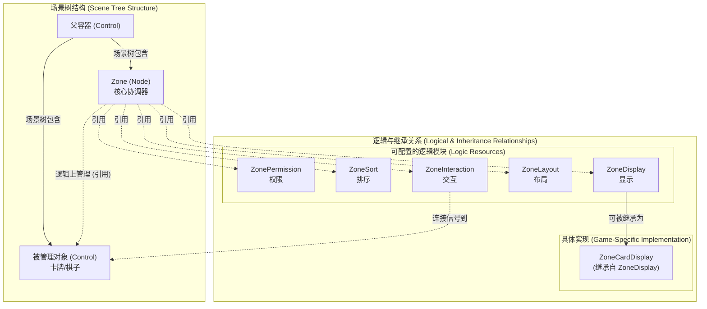

# 介绍

NascentSoul提供了一个模块化的框架，可以快速构建卡牌游戏中的常见功能，如牌库、手牌、弃牌堆等区域管理。

> 作者正在使用该库构建自己的卡牌游戏，会持续更新此库。欢迎提需求相关Issue。

这个插件的核心是 `Zone` 系统，它是一个区域管理器，通过组合不同的逻辑模块来实现各种游戏机制：

- **权限控制** (`ZonePermission`)：控制哪些对象可以进入特定区域
- **布局管理** (`ZoneLayout`)：处理对象在区域内的排列方式，包括弧形布局、堆叠布局、水平布局等
- **显示逻辑** (`ZoneDisplay`)：管理对象的视觉状态，如悬停效果、选中状态等
- **交互处理** (`ZoneInteraction`)：处理点击、拖拽、多选等用户交互
- **排序逻辑** (`ZoneSort`)：定义区域内对象的排序规则

插件还提供了一个基础的卡牌实现 (`ZoneCard`)，支持翻面动画和高亮效果。

## 示例

一个简单的拖拽示例。

## 结构

## 项目状态

⚠️ 此项目仍在早期开发阶段，API 可能会有变化。
